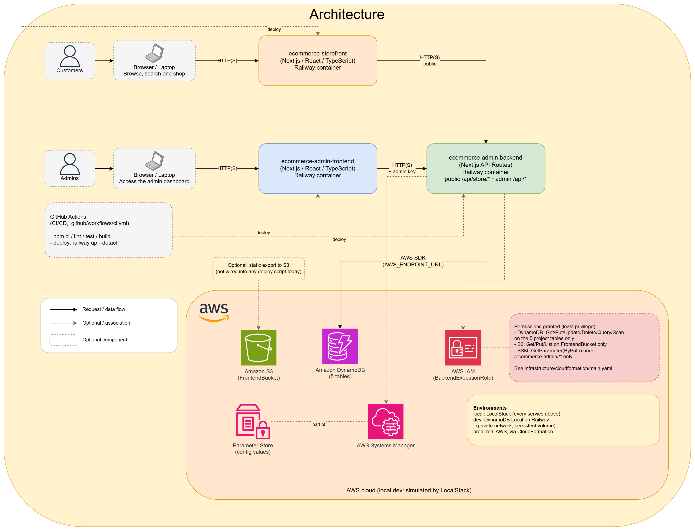
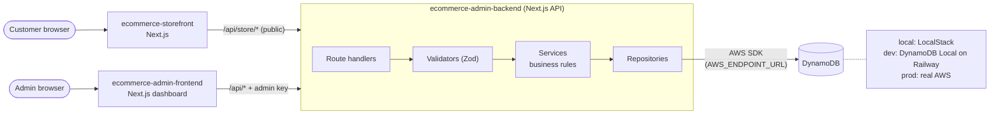

# ecommerce-admin-infra

Infrastructure and architecture documentation for the **ecommerce-admin**
e-commerce application (customer storefront + admin dashboard). This repo has
no application code — it defines how the infrastructure (DynamoDB, S3, IAM,
SSM) is created, documents the data model, and explains how the project's
other repos connect to each other.

## The repos

| Repo | Contents |
|---|---|
| **ecommerce-admin-infra** (this one) | CloudFormation, LocalStack, deployment scripts, local dev docker-compose, architecture and data-model docs |
| [ecommerce-admin-backend](../ecommerce-admin-backend) | Next.js API with the business rules. Public storefront routes (`/api/store/*`) and admin routes protected by an admin key. Reads/writes the DynamoDB tables defined here via environment variables — no infrastructure config hardcoded |
| [ecommerce-storefront](../ecommerce-storefront) | Customer-facing shop: browse, search, filter, product pages, cart, wishlist. Talks only to the backend's public routes |
| [ecommerce-admin-frontend](../ecommerce-admin-frontend) | Admin dashboard: manage products, categories, users, carts and wishlists. Consumes the backend's admin API; never talks to AWS/LocalStack directly |

The DynamoDB tables, keys, indexes, access patterns and pagination/search
decisions are documented in [`docs/DATA_MODEL.md`](docs/DATA_MODEL.md).



*(Editable source: [`docs/architecture.drawio`](docs/architecture.drawio) — open it at [app.diagrams.net](https://app.diagrams.net). The first page is the diagram above; the other pages are earlier versions.)*

The same application as a request-flow diagram (what runs inside the backend):



The backend never knows whether it's talking to LocalStack, DynamoDB Local
on Railway, or real AWS — it's all driven by a single environment variable,
`AWS_ENDPOINT_URL` (empty = real AWS). See
`ecommerce-admin-backend/lib/aws/config.ts`.

## Prerequisites

- [Docker](https://docs.docker.com/get-docker/) + [Docker Compose](https://docs.docker.com/compose/)
- Node.js 20+ (optional, only if you want to run something outside Docker)

No AWS CLI or AWS account needed for local development.

## Bringing up the full local environment

Each repo starts **independently** — this repo doesn't build or start
the apps, and they don't know how infra is built. Clone the 4 repos as
sibling folders:

```bash
git clone <infra-url> ecommerce-admin-infra
git clone <backend-url> ecommerce-admin-backend
git clone <frontend-url> ecommerce-admin-frontend
git clone <storefront-url> ecommerce-storefront
```

**1. Infrastructure first**, from `ecommerce-admin-infra`:

```bash
cp .env.example .env.local
docker compose up
```

Brings up LocalStack and deploys the CloudFormation stack on its own (via
the `ready.d` hook) — nothing else. Once
[http://localhost:4566/_localstack/health](http://localhost:4566/_localstack/health)
responds, the infrastructure is ready.

**2. Backend**, independently, from `ecommerce-admin-backend`:

```bash
docker compose up
```

Reaches LocalStack via `host.docker.internal:4566` (see that repo's
README). Once up: http://localhost:4000/api/health.

**3. Admin dashboard**, independently, from `ecommerce-admin-frontend`:

```bash
docker compose up
```

Once up: http://localhost:3000. It asks for the admin key; against a local
backend with no `ADMIN_API_KEY` set, any value works (see the backend README).

**4. Storefront**, independently, from `ecommerce-storefront`:

```bash
docker compose up
```

Once up: http://localhost:3001.

**5. Load sample data**, back in `ecommerce-admin-infra` (needs the backend
container from step 2 running): 5 categories and 15 products with images,
plus a sample cart and wishlist.

```bash
./scripts/seed-local.sh
```

**Shortcut for step 1** (start LocalStack + wait for the stack, nothing
more — steps 2-5 are still separate, on purpose):

```bash
./scripts/deploy-local.sh
```

Verify everything is responding (checks LocalStack, backend, dashboard and
storefront, wherever they were started from):

```bash
./scripts/health-check.sh
```

## CI/CD

GitHub Actions (`.github/workflows/ci.yml`) runs on every push, on any
branch, and on every pull request into `main`. Single job, `validate`:

1. Lints `infrastructure/cloudformation/main.yaml` with `cfn-lint`.
2. Smoke-tests it for real: `scripts/ci-deploy-local.sh smoke` builds and
   runs LocalStack in a container (GitHub's runners have Docker
   preinstalled) and deploys the CloudFormation stack against it — the same
   deploy path `local` uses, not a dry run.
3. `scripts/ci-deploy-local.sh health` checks that LocalStack (and the
   backend too, if that sibling repo happens to be checked out alongside
   this one) responded correctly.
4. `scripts/ci-teardown.sh` always runs afterward (`if: always()`), so a
   failed run doesn't leave containers behind.

This repo has nothing to deploy anywhere — it's infrastructure-as-code, not
a running service — so, unlike backend/frontend, there's no separate deploy
job here. The other repos each have their own equivalent
`.github/workflows/ci.yml`; see their READMEs for what those do. Free and
unlimited for public repos.

## Environments

| Environment | Where compute runs | Where the data lives |
|---|---|---|
| `local` | Docker, on your machine | LocalStack (this repo) |
| `dev` | Railway (backend, dashboard and storefront, each with its own deploy) | DynamoDB Local, as a Docker service on Railway — see below |
| `prod` | Not deployed | Real AWS (same `infrastructure/cloudformation/main.yaml`) |

### `dev`: DynamoDB Local on Railway

Railway doesn't offer DynamoDB as a native database (it has Postgres/MySQL/
Mongo/Redis). Instead, we deploy
[`amazon/dynamodb-local`](https://hub.docker.com/r/amazon/dynamodb-local)
as just another Docker service inside the Railway project — the backend
still talks to it with the same AWS SDK, only `AWS_ENDPOINT_URL` changes to
the internal URL Railway assigns that service.

Important difference from `local`/`prod`: DynamoDB Local **doesn't**
understand CloudFormation, IAM, or SSM — it only simulates the DynamoDB
API. So in `dev` the tables aren't created from
`infrastructure/cloudformation/main.yaml`: the backend's pre-deploy command
(`npm run init-tables`) creates any missing table on every deploy, with the same
keys and index, and
[`scripts/railway-dynamodb-init.sh`](scripts/railway-dynamodb-init.sh) does the
same by hand. The data sits on a persistent volume. Step-by-step guide:
[`docs/RAILWAY.md`](docs/RAILWAY.md).

## Structure

```
infrastructure/cloudformation/main.yaml   Shared template (local/prod)
docker/Dockerfile.localstack               LocalStack with the stack baked in
docker-compose.yml                          LocalStack only — nothing else
scripts/                                    Deployment, seed, health-check
e2e/                                        Browser tests (Playwright) for the admin dashboard and the storefront
.github/workflows/ci.yml                    Real CI: cfn-lint + LocalStack smoke test
docs/LOCALSTACK.md                          LocalStack parity per service
docs/RAILWAY.md                             DynamoDB Local on Railway, step by step
docs/architecture.drawio                    Architecture diagram, editable source
docs/architecture.png                       Architecture diagram, exported image
```

See also [`infrastructure/README.md`](infrastructure/README.md) for the
details of what the template creates.
